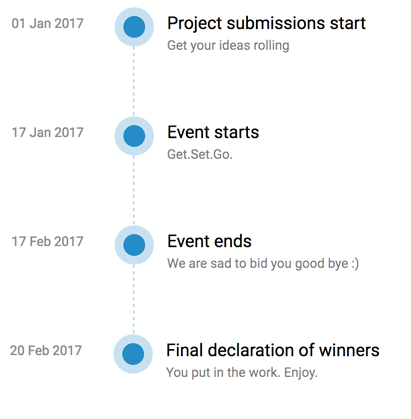

Who can participate?
----
Any undergraduate or postgraduate student.
P.S : There are no institute restrictions.

Projects under the event you can contribute to with label [opencode](https://github.com/search?l=&q=label%3Aopencode&ref=advsearch&type=Issues&utf8=%E2%9C%93)
---------------

- [OpenCodeCollab](https://github.com/fossiiita/opencodecollab)
- [Humble Fool Cup Website](https://github.com/fossiiita/humblefoolcup)
- [Django Event platofrm](https://github.com/gauthamzz/Django-EventPlatform)

Timeline
--------

[Connect with us on Gitter](https://gitter.im/opencode2017)

[Who all are participating](https://fossiiita.github.io/opencodecollab/)

> An Open Source Event : A Mini [GSOC](https://en.wikipedia.org/wiki/Google_Summer_of_Code)

<!--  -->

[Watch Trailer](https://www.youtube.com/watch?v=qkt9vMKYHAM&feature=youtu.be)

How this works
-----------

* Participants are required to solve the issues and earn points.
* The participants with the maximum points at the end of the event (17 February) will be adjudged the winner. 
* Projects registered for the event can be solved to earn points. All of them can be found at [foss iiita organisation](https://github.com/fossiiita) with label [opencode](https://github.com/search?l=&q=label%3Aopencode&ref=advsearch&type=Issues&utf8=%E2%9C%93).

Prizes
------
Prizes (Cash prizes as well as Goodies) will be awarded in the following categories:

1. Grand prize winner (selected from the TOP 5 by the organizers) : Cash prize worth 2.5k, T-shirt and Certficates.
2. Top 5 Participants based on points: T Shirts, Certificates and a cash prize worth Rs. 500/-
3. Participant with most points : T-shirt, Certficates and cash prize of 1k
4. Every participant will be awarded a digital participation certificate.
5. Top 5 will get direct admission to [Hack In the North](http://www.hackinthenorth.com/#home)
6. Amazon gift voucher worth Rs. 300/- will be presented to one lucky participant who puts the OpenCode poster as his facebook or tweets during the event. 

Only for IIITA students: Foss selection for next year will be from this event. A minimum of 50 points is required to apply.

Want to participate?
-----------------

Add yourself to Student section in [Opencodecolab](http://fossiiita.github.io/opencodecollab)

For more info [click here](https://github.com/fossiiita/opencodecollab#adding-yourselves-to-student-section)

Do you have an exciting idea for a project or want us to help you with your previous one? 
 Click [here](https://fossiiita.github.io/opencode/projects)

Scoring Criteria
----------------------

Issues will be graded into three categories by the team.
The grading will be done before the pr is sent.

* Category A: 10 points
* Category B: 20 points
* Category C: 30 points
* Category D: 00 points

For example, multiple pr to awesome lists and readme will fall under category D.

Contact Us
---------------------------
Want to sponsor the event / other queries?
Contact [Gautham](https://facebook.com/gauthamzz) or [Connect on Gitter](https://gitter.im/opencode2017)

- Gautham Santhosh
 * [Facebook](https://facebook.com/gauthamzz)
 * [GitHub](https://github.com/gauthamzz)

List of all the organizers can be found [here](https://fossiiita.github.io/opencodecollab).

[Frequently Asked Questions](https://fossiiita.github.io/opencode/faq)
